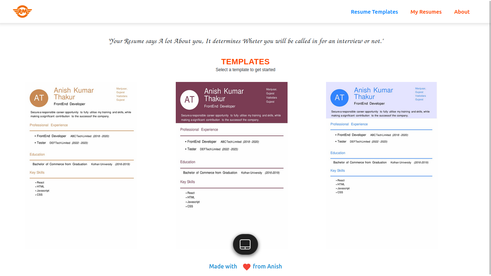
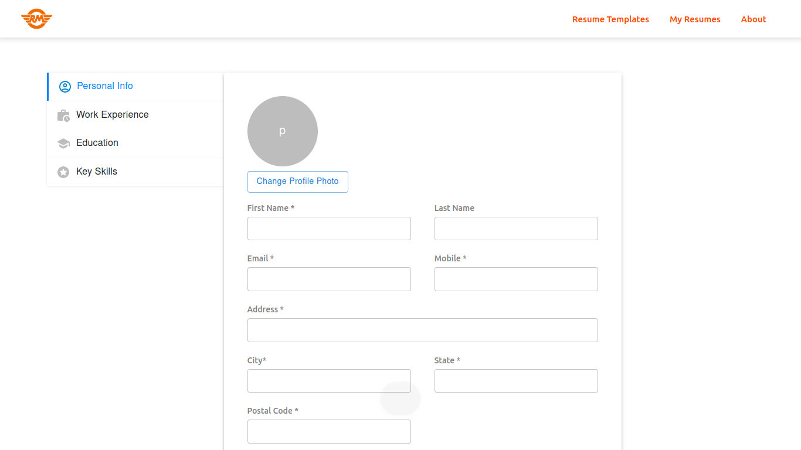

# Getting Started with Resume Builder

## Resume Builder :-
A resume builder app is a tool that allows users to create, edit, and share professional resumes quickly and easily. The app typically includes a variety of templates and design options that can be customized to suit the user's needs, as well as features such as text editing, formatting, and the ability to import and export data. Some resume builder apps also include additional tools such as a cover letter builder, a portfolio creator, and the ability to track the progress of job applications. Overall, a resume builder app is an efficient and effective way to create a professional, polished resume that stands out to potential employers and helps users to secure job opportunities.

<h3 align="center">
  Resume Builder Website Home page preview-  
  
  Resume Builder Website add detials page-   
   

</h3>

## Live link for project

https://ak804670.github.io/resumebuilder-app/

## Available Pages

In the project We have below pages.

### `HOME Page`
In Home Page you will see three preloaded templates from which 
you can choose your favourite resume template.

### `INFORMATION FILLING Page`

Once you choose your favourite template. Then you will be redirected to the fill details page.

Where you need to fill your details like Personal Information, Experience Details, Education Details and Skills.

There are some optional inputs also you can either fill them or leave them.

### `PREVIEW Page`

After filling all the details you will see the preview page where you can check the final preview of your resume. If there is any typing error you can go back the correct it. 

If its ok then you can choose the filename you want to give to your file and click on save to download a pdf file of you Resume. 

After clicking save Button you will be redirected to the Home Page.

### `MY RESUME Page`

**This App will use your local storage to store your saved Resumes**

My resume page page stores all the resumes you have created and shows them. Each resume contains three button :-

1) DOWNLOAD :- By clicking on this button you can simply download your resume file in PDF format.

2) EDIT :- By clicking the edit button you will be again redirected to fill details page where you can simply update your details the enter them.

3) DELETE:- This button deletes your saved resumes from your local storage.

### `ABOUT Page`

1) About page contains some information about the benifits of this resume builder Application.

2) About page contains some social media icon where the user can simply contact the developer of this web app.

## 🛠 Installation and Setup Instructions

1. Installation: `npm install`

2. In the project directory, you can run: `npm start`

##
<h4 align="center">Made with ❤️ from Anish</h4>
<h4 align="center">Thank You</h4>

